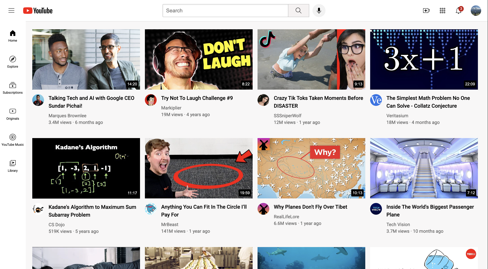

# 🎬 YouTube UI Clone

A frontend clone of the YouTube homepage built using **HTML5** and **CSS3**. This project was created to practice modern web layout techniques, component-based styling and building a real-world user interface from scratch.

## 📸 Preview



---

## 🚀 Live Demo

https://arjunsudheer-tech.github.io/youtube-ui-clone/


---

## ✨ Features

* YouTube inspired homepage layout
* Header with search bar and navigation icons
* Sidebar navigation
* Video card grid layout
* Separate CSS files for better organization
* Clean folder structure with organized assets

---

## 🛠️ Built With

* HTML5
* CSS3

---

## 📂 Project Structure

```
youtube-ui-clone/
│
├── index.html
├── styles/
│   ├── general.css
│   ├── header.css
│   ├── sidebar.css
│   └── video.css
│
├── icons/
├── channel-pictures/
└── README.md
```

---

## 🎯 What I Learned

While building this project, I practiced:

* Structuring a web page using semantic HTML
* Building layouts with Flexbox and CSS Grid
* Organizing CSS into multiple reusable files
* Working with images and icons
* Improving overall frontend code organization

---

## 📈 Future Improvements

* Add dark mode
* Implement search functionality using JavaScript
* Add interactive sidebar
* Improve accessibility with better `alt` text and ARIA labels

---

## 👨‍💻 Author

**Arjun S**

* GitHub: https://github.com/arjunsudheer-tech
* LinkedIn: https://www.linkedin.com/in/arjunsudheer-tech/

---

⭐ If you like this project, consider giving it a star.
